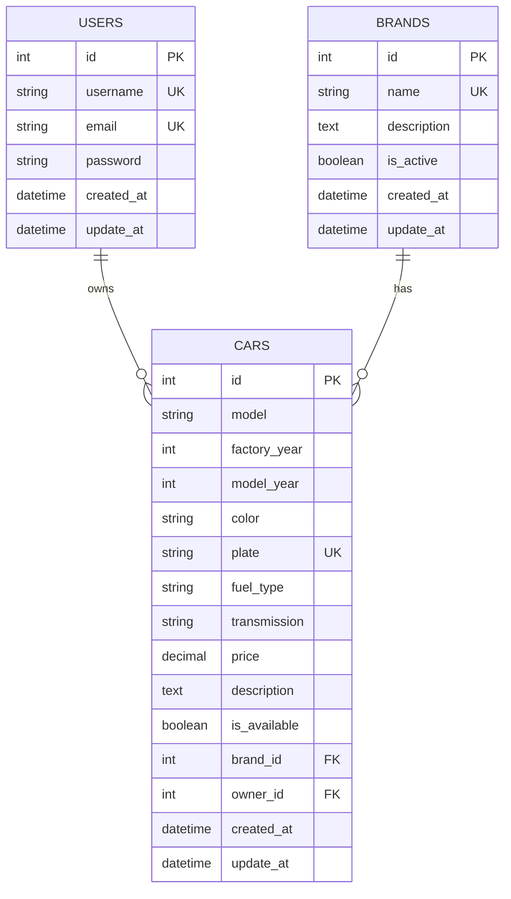
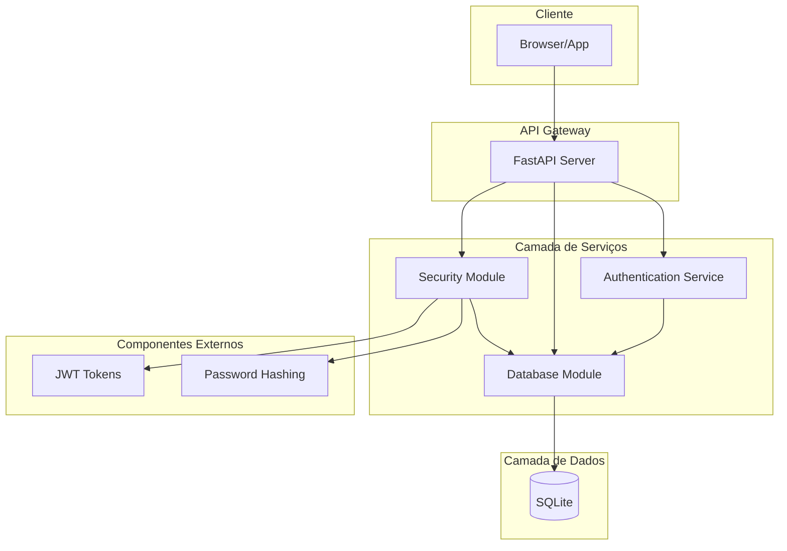
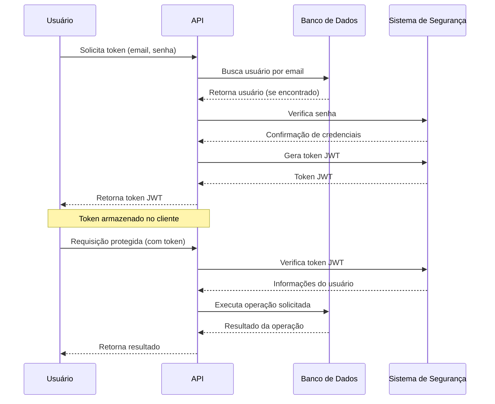
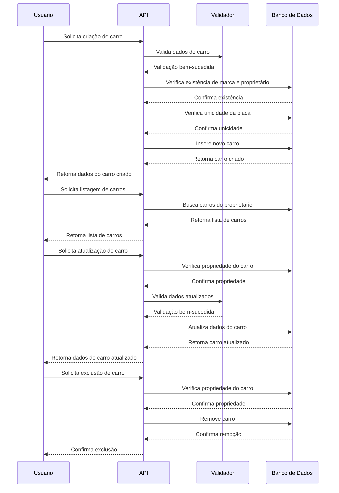
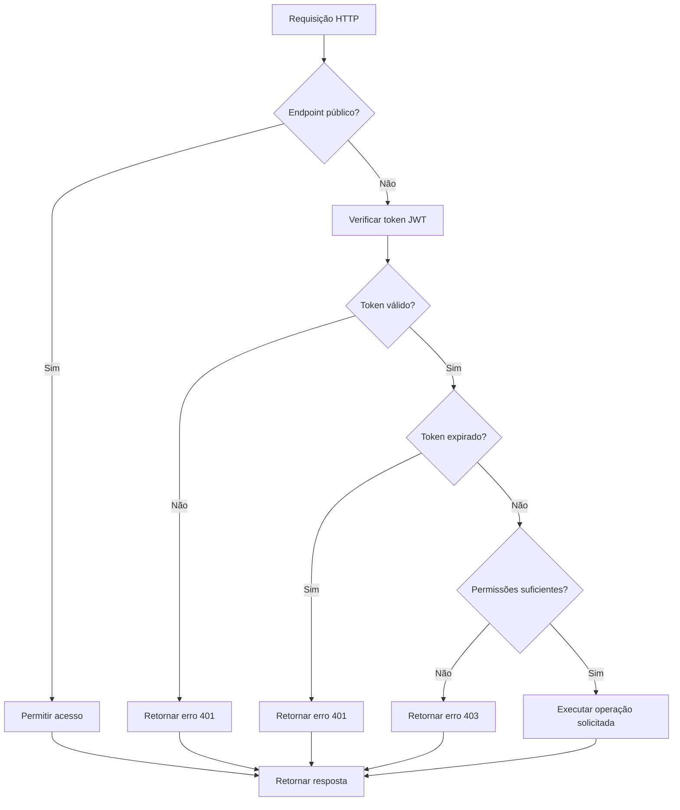

# Modelagem do Sistema

Este documento apresenta a modelagem do sistema da API de Gerenciamento de Carros, incluindo diagramas de entidade-relacionamento, arquitetura, fluxos de autenticação e segurança.

## Modelos de Dados

### Diagrama ERD (Entidade-Relacionamento)

### Descrição dos Modelos

#### Usuário (User)
- **id**: Identificador único do usuário (chave primária)
- **username**: Nome de usuário único
- **email**: Endereço de email único
- **password**: Senha hash do usuário
- **created_at**: Data de criação do registro
- **update_at**: Data da última atualização do registro
- **cars**: Relacionamento um-para-muitos com Carros (um usuário pode possuir muitos carros)

#### Marca (Brand)
- **id**: Identificador único da marca (chave primária)
- **name**: Nome da marca (único)
- **description**: Descrição opcional da marca
- **is_active**: Indica se a marca está ativa
- **created_at**: Data de criação do registro
- **update_at**: Data da última atualização do registro
- **cars**: Relacionamento um-para-muitos com Carros (uma marca pode ter muitos carros)

#### Carro (Car)
- **id**: Identificador único do carro (chave primária)
- **model**: Modelo do carro
- **factory_year**: Ano de fabricação
- **model_year**: Ano do modelo
- **color**: Cor do carro
- **plate**: Placa do carro (única)
- **fuel_type**: Tipo de combustível (gasolina, etanol, flex, diesel, elétrico, híbrido)
- **transmission**: Tipo de transmissão (manual, automática, semi-automática, CVT)
- **price**: Preço do carro
- **description**: Descrição opcional do carro
- **is_available**: Indica se o carro está disponível
- **brand_id**: Referência à marca (chave estrangeira)
- **owner_id**: Referência ao proprietário (chave estrangeira)
- **created_at**: Data de criação do registro
- **update_at**: Data da última atualização do registro
- **brand**: Relacionamento muitos-para-um com Marca
- **owner**: Relacionamento muitos-para-um com Usuário

## Arquitetura do Sistema

### Componentes da Arquitetura

#### Cliente
- **Browser/App**: Interface do usuário que consome a API

#### API Gateway
- **FastAPI Server**: Servidor que expõe os endpoints da API REST

#### Camada de Serviços
- **Security Module**: Responsável por autenticação, autorização e segurança
- **Database Module**: Gerencia a conexão e operações com o banco de dados
- **Authentication Service**: Implementa a lógica de autenticação e geração de tokens

#### Camada de Dados
- **SQLite**: Banco de dados relacional onde os dados são armazenados

#### Componentes Externos
- **JWT Tokens**: Implementação de tokens JSON Web para autenticação
- **Password Hashing**: Implementação de hashing seguro para senhas

## Fluxo de Autenticação

### Etapas do Fluxo de Autenticação

1. **Solicitação de Token**: O usuário envia email e senha para obter um token JWT
2. **Verificação de Credenciais**: A API verifica as credenciais no banco de dados
3. **Geração de Token**: Um token JWT é gerado e retornado ao usuário
4. **Armazenamento de Token**: O token é armazenado no cliente para uso futuro
5. **Requisição Protegida**: O cliente envia o token em requisições subsequentes
6. **Verificação de Token**: A API verifica a validade do token JWT
7. **Execução da Operação**: A operação solicitada é executada após verificação

## Fluxo CRUD de Carros

### Etapas do Fluxo CRUD de Carros

1. **Criação de Carro**:
   - Validação dos dados do carro
   - Verificação da existência de marca e proprietário
   - Verificação da unicidade da placa
   - Inserção do novo carro no banco de dados

2. **Listagem de Carros**:
   - Busca de carros pertencentes ao proprietário autenticado
   - Retorno da lista de carros com informações relacionadas

3. **Atualização de Carro**:
   - Verificação da propriedade do carro pelo usuário
   - Validação dos dados atualizados
   - Atualização dos dados no banco de dados

4. **Exclusão de Carro**:
   - Verificação da propriedade do carro
   - Remoção do carro do banco de dados

## Fluxo de Segurança

### Etapas do Fluxo de Segurança

1. **Verificação de Endpoint Público**: Determina se o endpoint requer autenticação
2. **Verificação de Token JWT**: Analisa o token enviado no header de autorização
3. **Validação de Token**: Verifica se o token é válido e não foi manipulado
4. **Verificação de Expiração**: Confirma se o token ainda está dentro do período de validade
5. **Verificação de Permissões**: Avalia se o usuário tem permissões para executar a operação
6. **Execução ou Negativa**: Permite ou nega a execução da operação com base nas verificações anteriores

## Considerações de Segurança

- **Tokens JWT**: Utilizados para autenticação stateless
- **Hashing de Senhas**: Senhas são armazenadas com Argon2 para segurança
- **Validação de Dados**: Todos os dados de entrada são validados com Pydantic
- **Controle de Acesso**: Verificação de propriedade para operações em carros
- **Proteção contra Injeção**: Uso de SQLAlchemy previne SQL injection
- **Autenticação por Middleware**: Implementação centralizada de verificação de tokens